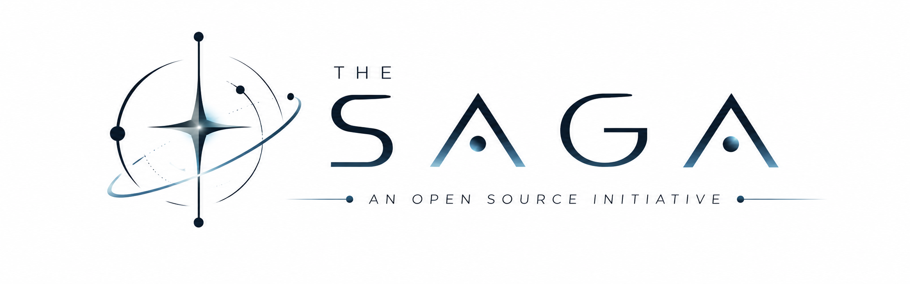
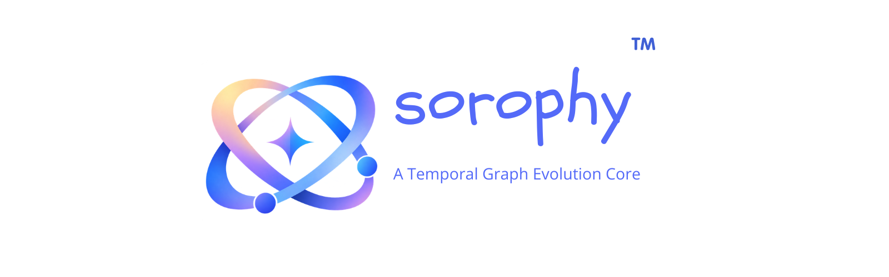

<h1 align="center">Hi, I'm Subhradeep Sarkar 👋</h1>

Founder & Lead Maintainer of <b>The Saga</b> and <b>Sorophy™</b>

  

  <a href="https://github.com/Phantom-Con-Artist/The-Saga-Documentation">
    📖 The Saga Documentation
  </a>

---

## 🌌 A New Chapter for The Saga

The rebranding and restructuring of **Orbis** is now complete.

What was previously known as the **Orbis Project** and **Orb Engine** has been restructured and rebranded under **The Saga**.

The engine is now officially known as **Sorophy™**.

The project has also moved toward a clearer separation between its architecture, implementation, and applications:

- **The Saga** — the open architecture and philosophy
- **Sorophy™** — the temporal graph evolution core and reference implementation
- **Myriad Ecosystem** — applications and tools built around Sorophy™

You can explore the complete documentation here:

<a href="https://github.com/Phantom-Con-Artist/The-Saga-Documentation">
  📚 <b>Visit The Saga Documentation</b>
</a>

---

## 🚀 Sorophy™ v1 is Stable

I'm happy to announce that **Sorophy™ v1.0.0 is officially released as a stable version.**

The v1 stable release has completed its validation and is now available through the Sorophy repository.

**Sorophy™ v1.0.0**
- 🟢 Stable
- 🏅 Grade A
- 🥈 Silver Standard
- 📦 NuGet packages available
- 🧪 Full test suite validated
- ⚡ Stress testing validated

And alongside the stable v1 release:

### ⚡ Sorophy™ v2 — Krono is officially in Beta

The next generation of Sorophy is now under active development.

**Sorophy™ v2 — Krono** introduces the next evolution of the architecture, with a stronger focus on temporal information, history, evolution, and change.

You can follow Sorophy's development and releases here:

<a href="https://github.com/Phantom-Con-Artist/Sorophy">
  🔮 <b>Visit the Sorophy™ Repository</b>
</a>

---

## 🛑 Orbpad Development Has Ended

There is one important project update I also want to make clear.

**I am stopping active maintenance of Orbpad.**

The **Orbpad repository will remain public**, and all existing releases will remain available for download.

Orbpad v1.0.0 is a standalone application and does **not** use the Sorophy™ backend.

Orbpad v1.0.1, however, runs on the **Orb Engine v1.0.0-beta.2** backend — making it part of the early history of what eventually became Sorophy™.

You can still explore the project and its releases here:

<a href="https://github.com/Phantom-Con-Artist/Orbpad">
  📝 <b>Visit Orbpad</b>
</a>

### Why am I stopping Orbpad?

Orbpad gradually evolved into something much larger than I originally intended.

It was slowly becoming:

> **Everything + Orb Engine support**

And while that was an interesting direction, it moved Orbpad away from its original role within the **Myriad Ecosystem**.

Continuing to redesign and maintain Orbpad around an ever-expanding set of features and Orb Engine support would require a substantial amount of time while pulling focus away from the development of **Sorophy™**, **The Saga**, and the wider Myriad Ecosystem.

Rather than continuing to turn Orbpad into something it was never meant to be, I have decided to stop active development and preserve it as it is.

The **Orbpad repository will remain public**, and its existing releases will remain available for anyone who wants to download and use them.

In fact, **Orbpad v1.0.0 is an important part of the project's history**. It is a standalone application and an early demonstration of the potential that eventually led to Orb Engine and, ultimately, Sorophy™.

Orbpad v1.0.1 later became one of the earliest applications built around the Orb Engine v1 lineage.

So while Orbpad's development ends here, the project itself remains available as a reminder of where everything started.

More or less, **Orbpad will remain a remembrance of how The Saga began.**

### 🧡 Orbpad Was the Beginning

Orbpad v1.0.0 is more than just an old application.

It is one of the earliest demonstrations of what the **Orb Engine — now Sorophy™ — was capable of becoming.**

It was the software that helped prove the idea could actually work.

So even though Orbpad is no longer being maintained, it will remain public as a piece of the project's history.

In a way, **Orbpad is a remembrance of how everything started.**

---

## 🔮 What's Next?

I'm currently focusing on **Sorophy™**, **The Saga Architecture**, and the future of the **Myriad Ecosystem**.

I'll also be working on a new piece of software dedicated specifically to **interacting with Sorophy™**.

More details will come soon.

For now, the foundation is finally in place:

**The Saga.**

**Sorophy™.**

**Myriad.**

And this is only the beginning.

---

Thank you for following the project, testing things, giving feedback, and sticking around through all the renaming, restructuring, broken builds, questionable architectural decisions, and general chaos. 😂

Seriously - thank you.

There's a lot more to build.

**See you in the next chapter.** 🖤

---

<b>The Saga</b> 
<i>Information should be structured with Time.</i>

